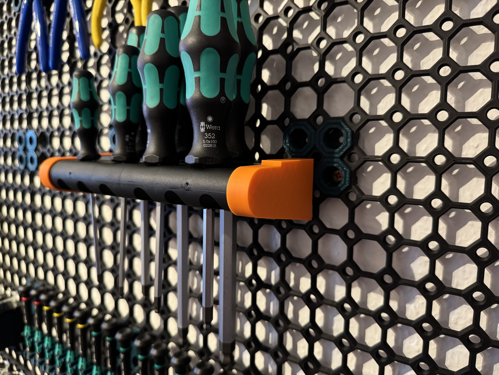

# Wera Kraftform Holder to Multiboard Adapter

This adapter allows you to connect the Wera Kraftform holder to your Multiboard.

The project was created using OpenSCAD in the configuration section the height and the position of the Multiboard snap insert.

  

  

  

